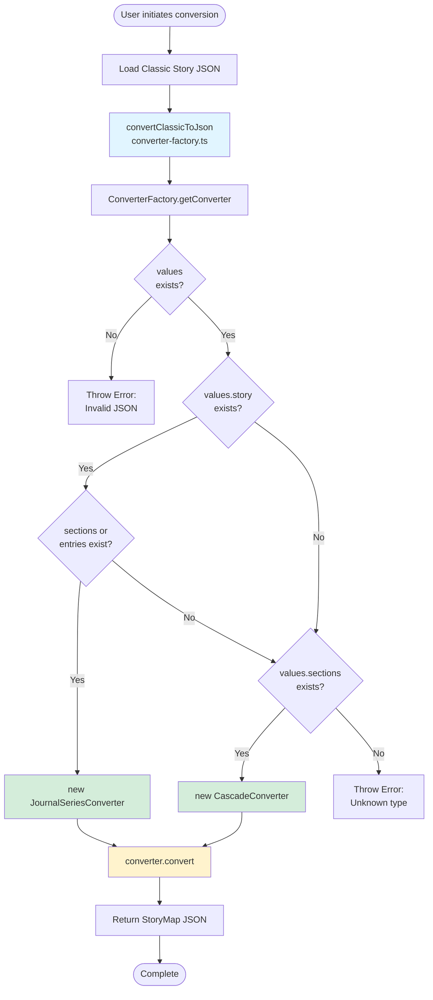
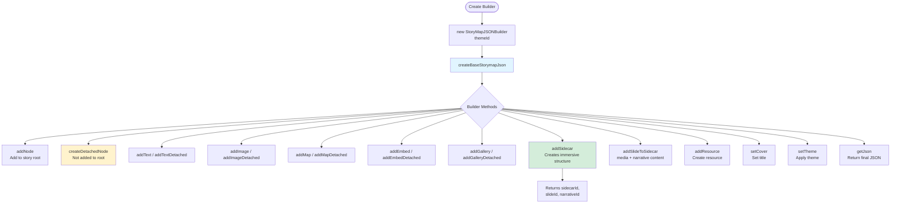
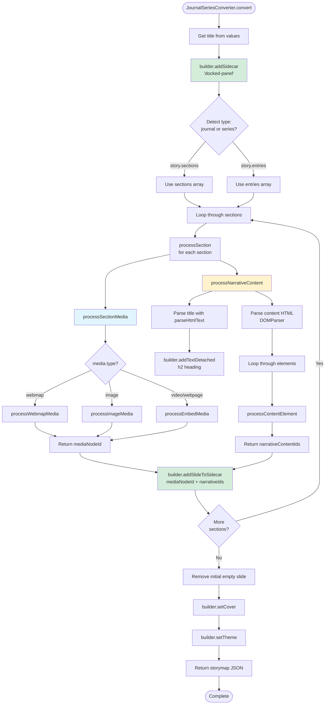
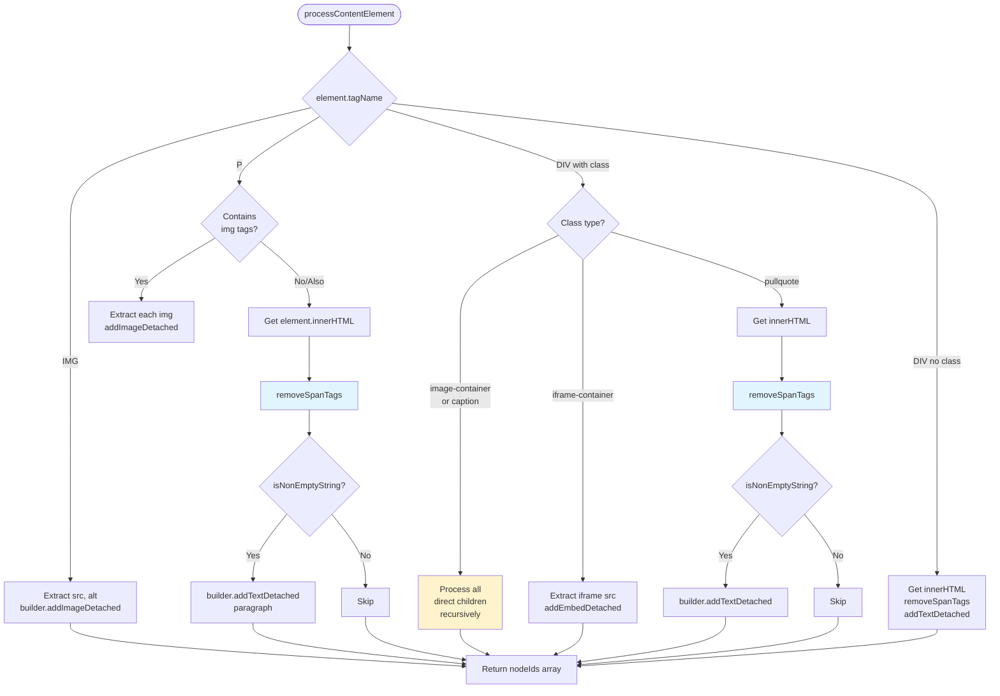
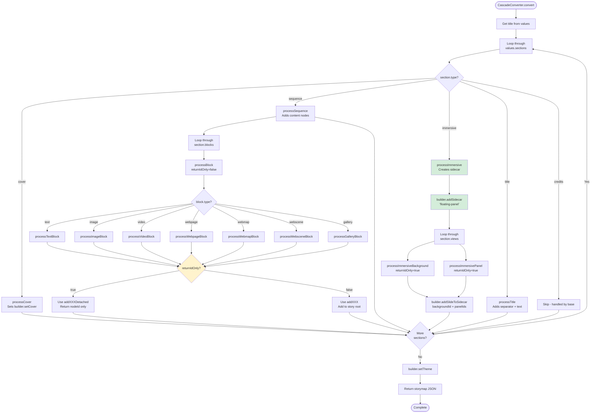
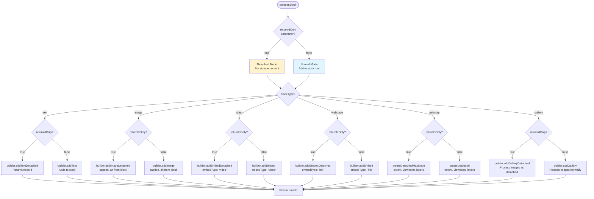
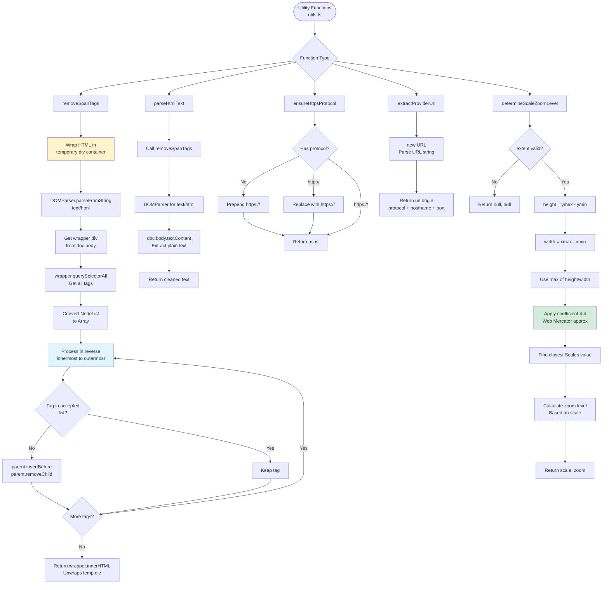

# TypeScript Converter Flow Diagrams

Visual documentation for the TypeScript-based Classic StoryMap converter web application. These diagrams complement the Python converter diagrams in the root `CONVERTER_LOGIC_DIAGRAM.md`.

---

## 1. High-Level TypeScript Conversion Flow

---

## 2. StoryMapJSONBuilder Overview

---

## 3. Journal/Series Converter Flow

---

## 4. Journal/Series Content Processing

---

## 5. Cascade Converter Flow

---

## 6. Cascade Block Processing

---

## 7. Utility Functions

---

## Key Differences from Python Implementation

### 1. Detached Node Pattern

TypeScript implementation uses explicit "detached" methods for sidecar content:

- `addTextDetached()`, `addImageDetached()`, etc.
- Prevents duplicate nodes in story root
- Cleaner separation of concerns

### 2. DOM Manipulation

TypeScript uses browser's native `DOMParser`:

- `DOMParser.parseFromString()` instead of BeautifulSoup
- `querySelectorAll()` for element selection
- Must wrap HTML in temporary container div to prevent document-level manipulation errors

### 3. Type Safety

TypeScript provides compile-time type checking:

- Interface definitions in `storymap.d.ts`
- Type-safe function parameters
- Catches errors before runtime

### 4. Async Operations

TypeScript version handles async image transfers:

- Downloads images from classic story resources
- Uploads to target story via REST API
- Updates JSON with new resource IDs

### 5. Factory Pattern

Explicit factory class for converter selection:

- `ConverterFactory.getConverter()`
- Cleaner entry point
- Better error handling for unknown types

---

## Notes

- All line numbers reference the TypeScript source files in `converter-app/src/converter/`
- Diagrams focus on core conversion logic (not REST API calls or UI)
- See main project `CONVERTER_LOGIC_DIAGRAM.md` for Python converter diagrams
- Both implementations produce identical JSON output (except for random IDs)
